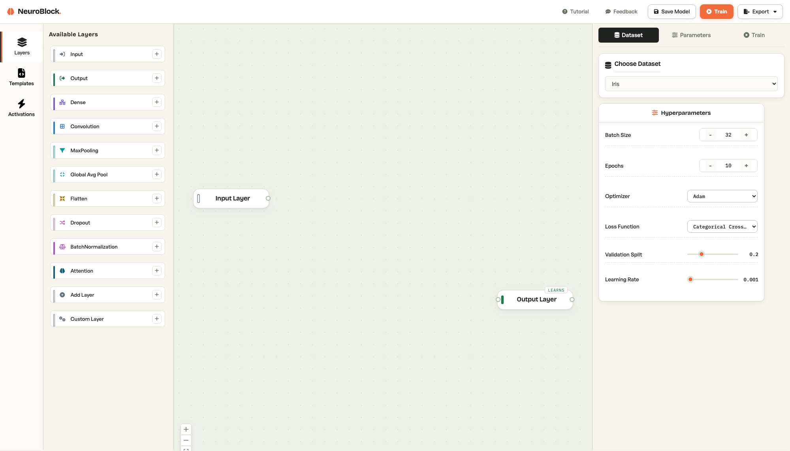

# NeuroBlock

Build, train, and export neural networks by connecting blocks on a canvas.
No code required — but real code comes out.



NeuroBlock is a visual environment for learning deep learning by doing.
Students drag layers onto a canvas, wire them together, pick a dataset, and
watch the network train live — loss and accuracy streaming in over
WebSockets, epoch by epoch. When the model works, they export it as the real
thing: a Python script, a Jupyter notebook, a Keras model, or a PyTorch
implementation of the network they just built.

It was built for high-school students, where it
introduces them to neural networks. It works just as well
for anyone who wants to understand what `Conv2D(32, (3, 3))` actually does
before writing it.

## How it works

1. Pick a dataset — MNIST, CIFAR-10, Iris, Breast Cancer, California
   Housing, or upload your own CSV or image archive.
2. Drag layers from the palette and connect them: Input through Dense,
   Conv2D, pooling, Dropout, BatchNorm, Attention, or full ResNet blocks,
   down to Output.
3. Set hyperparameters, hit Train, and watch the run live: per-epoch
   metrics, loss curves, and a confusion matrix when it finishes.
4. Test the trained model in the browser (draw a digit against your MNIST
   model), then export it in the format you want.

A small design detail that earns its keep in the classroom: every layer's
color rail encodes whether it learns. Filled rail means the layer has
trainable parameters; hollow rail means it only transforms its input.
Counting the filled nodes tells you where your parameters live.

Uploaded datasets are isolated per browser session and cleaned up
automatically, so thirty students can share one server without stepping on
each other.

## Quick start

### Docker (recommended)

The production image is a single container: Flask serves the built React
app, the REST API, and the WebSocket stream from one origin.

```bash
git clone https://github.com/aryamangoenka/NeuroBlock.git
cd NeuroBlock
docker compose up -d --build
```

Open http://localhost:8080. That is the entire deployment.

### Local development

You need Python 3.10–3.12, Node 18+, and [Poetry](https://python-poetry.org/docs/#installation).

Backend (terminal 1):

```bash
poetry env use python3.12
poetry install
./run_backend.sh
```

The API starts on http://localhost:8080. The first start takes a minute or
two while TensorFlow initializes; `curl localhost:8080/api/health` tells you
when it is up.

Frontend (terminal 2):

```bash
cd frontend
npm install
npm run dev
```

Open http://localhost:5173. The dev server proxies nothing — the frontend
talks to the backend directly, and `VITE_BACKEND_URL` in `frontend/.env`
overrides the default if you run the API elsewhere.

## Architecture

```
├── Dockerfile        Single production image (frontend build + Python runtime)
├── backend/          Flask + Flask-SocketIO + TensorFlow
│   ├── api/          REST routes and WebSocket training events
│   ├── models/       Graph-to-Keras model builder
│   ├── datasets/     Built-in dataset loaders
│   ├── export/       Python / notebook / Keras / PyTorch generators
│   ├── training/     Real-time training callbacks
│   └── utils/        Session isolation, logging, image processing
├── frontend/         React 18 + TypeScript + Vite, ReactFlow canvas
├── landing/          Marketing page (Next.js, optional, deployed separately)
└── docs/             Deployment guide and reference docs
```

The backend turns the canvas graph into a Keras model via topological sort,
trains it in-process, and streams progress through Socket.IO. Training
state lives in process memory and on local disk, which is why production
runs exactly one instance with one worker — a deliberate trade that keeps
the system simple and is plenty for classroom scale.

In production the frontend is compiled into the image and served by Flask,
so app, API, and sockets share one origin and CORS configuration is not a
thing you have to think about.

## Configuration

| Variable | Default | Purpose |
|---|---|---|
| `PORT` | `8080` | Server port |
| `FLASK_CONFIG` | `development` locally, `production` in the container | Config profile |
| `SECRET_KEY` | — | Session signing key; set a real one in production |
| `SESSION_COOKIE_SECURE` | `true` | Set `false` when serving plain HTTP (e.g. a bare-IP classroom server) |
| `SESSION_MAX_AGE` | `168` | Hours before per-session uploads are cleaned up |
| `EXTRA_ALLOWED_ORIGINS` | empty | Extra CORS origins, only needed for split deployments |
| `VITE_BACKEND_URL` | same-origin | Frontend build-time API override |

## Deployment

See [docs/DEPLOYMENT.md](docs/DEPLOYMENT.md). The short version: build the
container, run it on one machine. The guide has a 15-minute AWS EC2
walkthrough (what the Turing program uses); any Docker host with 4 GB of
RAM and WebSocket support works. Costs and trade-offs are spelled out there.

## Tests

```bash
./run_tests.sh              # backend (pytest)
cd frontend && npm run lint # frontend lint
cd frontend && npm run build # type-check + production build
```

## Design

The interface follows a documented design system ("Paper Lab") — warm paper
surfaces, a single reserved accent color for anything alive or learning,
monospaced numerals for every live metric, and a colorblind-validated layer
palette. [DESIGN.md](DESIGN.md) is the source of truth; UI changes should
be checked against it.

## Contributing

Issues and pull requests are welcome. Keep changes consistent with
DESIGN.md for anything visual, and run the tests before opening a PR. If
you are planning something larger, open an issue first so we can talk it
through.

## License

MIT — see [LICENSE](LICENSE).

## Acknowledgments

Built by [Aryaman Goenka](https://github.com/aryamangoenka). Used in the
Turing summer program at UMass Amherst CICS — thanks to the program staff
and the students whose questions shaped the tool.
